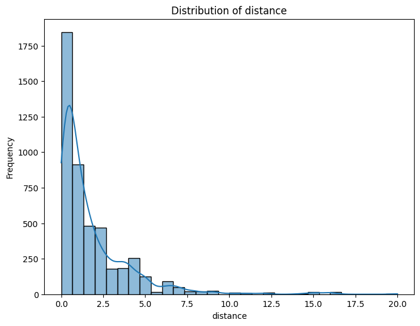
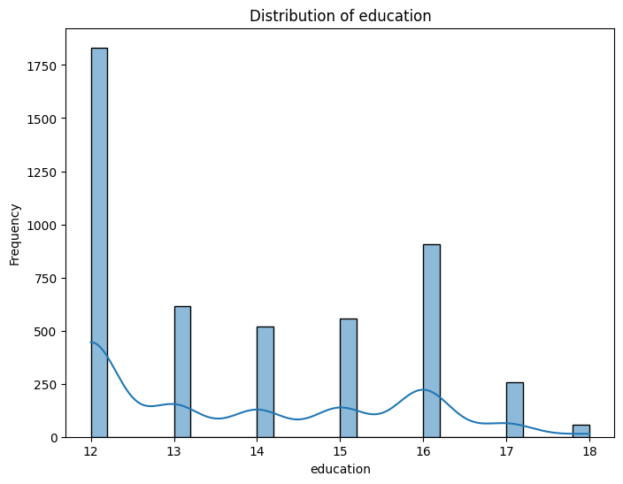
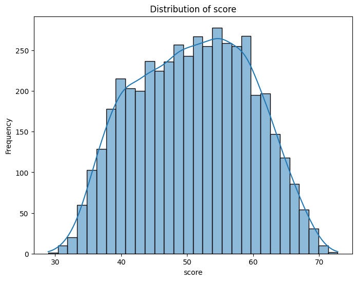
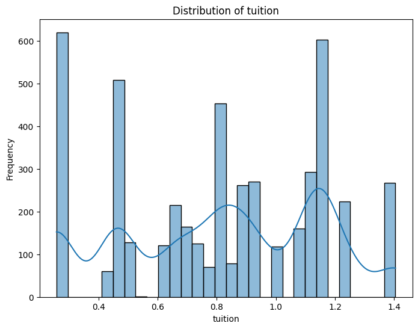
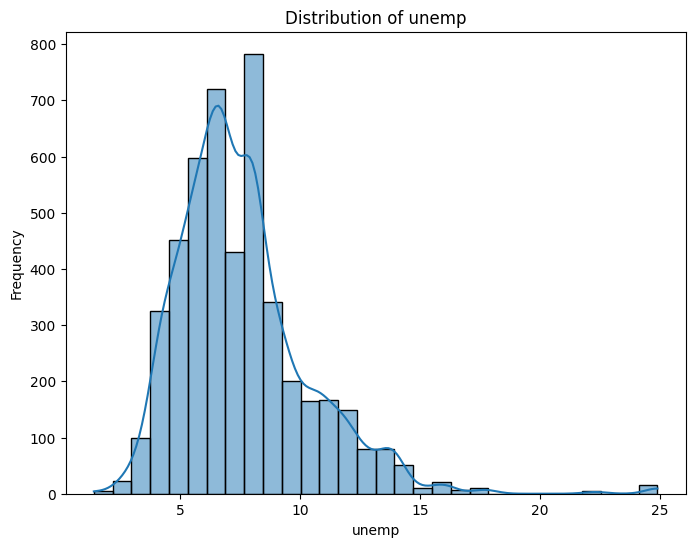
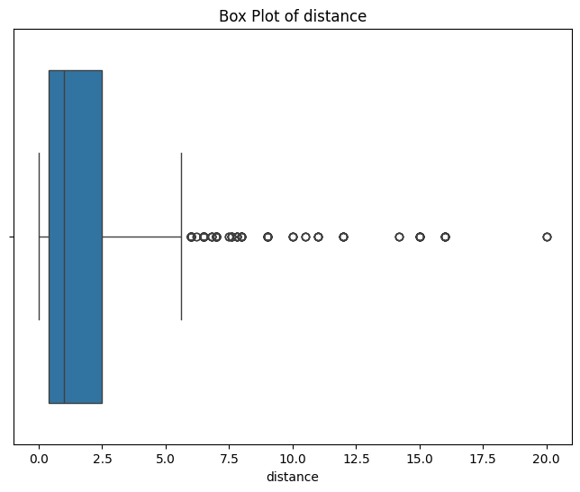
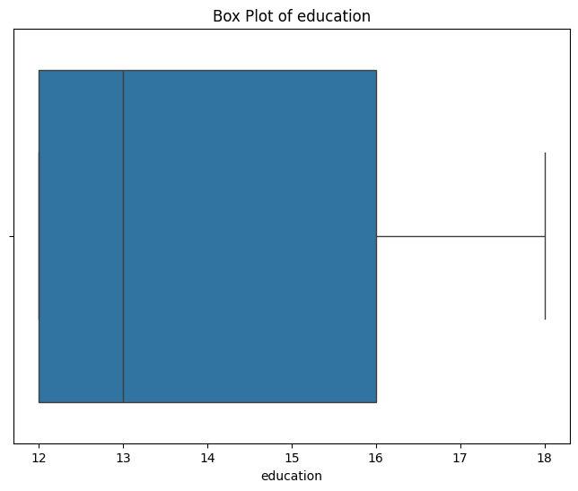
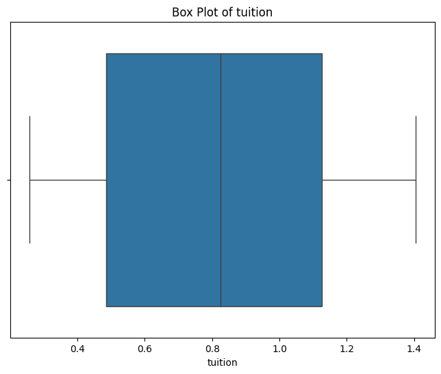
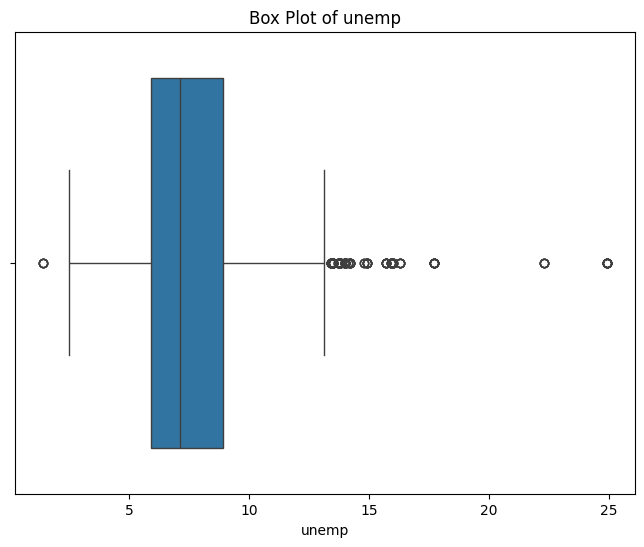
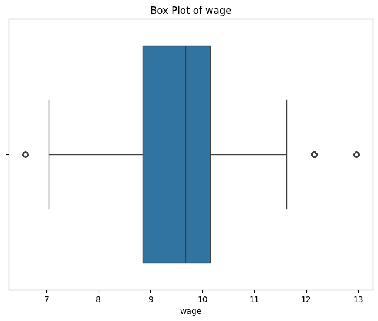

# Data explore on College Distance dataset

## Introduction

---------

Given the [dataset](https://vincentarelbundock.github.io/Rdatasets/csv/AER/CollegeDistance.csv) with cross-section data
from the High School and Beyond survey conducted by the Department of Education (USA) in 1980, with a follow-up in 1986.
The survey included students from approximately 1,100 high schools.

The goal is to create an ML model that will predict the `base year composite tets score` or just the `score` feature in
the dataset.

## Details

---------

[All given information comes from this page](https://vincentarelbundock.github.io/Rdatasets/doc/AER/CollegeDistance.html)

Rouse (1995) computed years of education by assigning 12 years to all members of the senior class. Each additional year
of secondary education counted as a one year. Students with vocational degrees were assigned 13 years, AA degrees were
assigned 14 years, BA degrees were assigned 16 years, those with some graduate education were assigned 17 years, and
those with a graduate degree were assigned 18 years.

Stock and Watson (2007) provide separate data files for the students from Western states and the remaining students.
CollegeDistance includes both data sets, subsets are easily obtained (see also examples).

### Source

Online complements to Stock and Watson (2007).

### References

Rouse, C.E. (1995). Democratization or Diversion? The Effect of Community Colleges on Educational Attainment. Journal of
Business & Economic Statistics, 12, 217–224.

Stock, J.H. and Watson, M.W. (2007). Introduction to Econometrics, 2nd ed. Boston: Addison Wesley.

### Data format

A data frame containing 4739 observations based on 14 variables (15 including `rownames` feature).

Features explained:

+ `gender`: factor indicating gender.
    * Type: categorical
    * Possible values: `female` or `male`.
+ `ethnicity`: factor indicating ethnicity.
    * Type: categorical
    * Possible values: `afam` (African-American), `hispanic` or `other`.
+ `score`: base year composite test score. These are achievement tests given to high school seniors in the sample.
    * Type: `float`
    * Possible values: non-negative floating point number.
+ `fcollege`: factor. Is the father a college graduate?
    * Type: categorical
    * Possible values: `yes` or `no`.
+ `mcollege`: factor. Is the mother a college graduate?
    * Type: categorical
    * Possible values: `yes` or `no`.
+ `home`: factor. Does the family own their home?
    * Type: categorical
    * Possible values: `yes` or `no`.
+ `urban`: factor. Is the school in an urban area?
    * Type: categorical
    * Possible values: `yes` or `no`.
+ `unemp`: county unemployment rate in 1980.
    * Type: `float`
    * Possible values: non-negative floating point number.
+ `wage`: state hourly wage in manufacturing in 1980.
    * Type: `float`
    * Possible values: non-negative floating point number.
+ `distance`: distance from 4-year college (in 10 miles).
    * Type: `float`
    * Possible values: non-negative floating point number.
+ `tuition`: average state 4-year college tuition (in 1000 USD).
    * Type: float
    * Possible values: non-negative floating point number.
+ `education`: number of years of education.
    * Type: `int`
    * Possible values: non-negative integer.
+ `income`: factor. Is the family income above USD 25,000 per year?
    * Type: categorical
    * Possible values: `low` or `high`.
+ `region`: factor indicating region.
    * Type: categorical
    * Possible values: `west` or `other`.

## First look at the data

| rownames | gender | ethnicity | score              | fcollege | mcollege | home | urban | unemp             | wage             | distance            | tuition            | education | income | region |
|----------|--------|-----------|--------------------|----------|----------|------|-------|-------------------|------------------|---------------------|--------------------|-----------|--------|--------|
| 1        | male   | other     | 39.150001525878906 | yes      | no       | yes  | yes   | 6.199999809265137 | 8.09000015258789 | 0.20000000298023224 | 0.8891500234603882 | 12        | high   | other  |
| 2        | female | other     | 48.869998931884766 | no       | no       | yes  | yes   | 6.199999809265137 | 8.09000015258789 | 0.20000000298023224 | 0.8891500234603882 | 12        | low    | other  |
| 3        | male   | other     | 48.7400016784668   | no       | no       | yes  | yes   | 6.199999809265137 | 8.09000015258789 | 0.20000000298023224 | 0.8891500234603882 | 12        | low    | other  |
| 4        | male   | afam      | 40.400001525878906 | no       | no       | yes  | yes   | 6.199999809265137 | 8.09000015258789 | 0.20000000298023224 | 0.8891500234603882 | 12        | low    | other  |
| 5        | female | other     | 40.47999954223633  | no       | no       | no   | yes   | 5.599999904632568 | 8.09000015258789 | 0.4000000059604645  | 0.8891500234603882 | 13        | low    | other  |

### Amount of empty cells:

``` py linenums="1"
data_df.isnull().sum()
```
Code output:
``` markdown
rownames     0
gender       0
ethnicity    0
score        0
fcollege     0
mcollege     0
home         0
urban        0
unemp        0
wage         0
distance     0
tuition      0
education    0
income       0
region       0
```

Dataset contains no empty or `null` cells.

### Distributions of the features

Plot with distribution of distances


Plot with distribution of education


Plot with distribution of score


Plot with distribution of tuition


Plot with distribution of unemployment


Plot with distribution of wage


!!! note
    The `rownames` feature is missing because it only represents index of the row. Therefore, it is safe to drop this feature in this project.

### Box plots of the features

Box plot of the `distance` feature


Box plot of the `education` feature


Box plot of the `score` feature


Box plot of the `tuition` feature


Box plot of the `unemp` feature


Box plot of the `wage` feature


