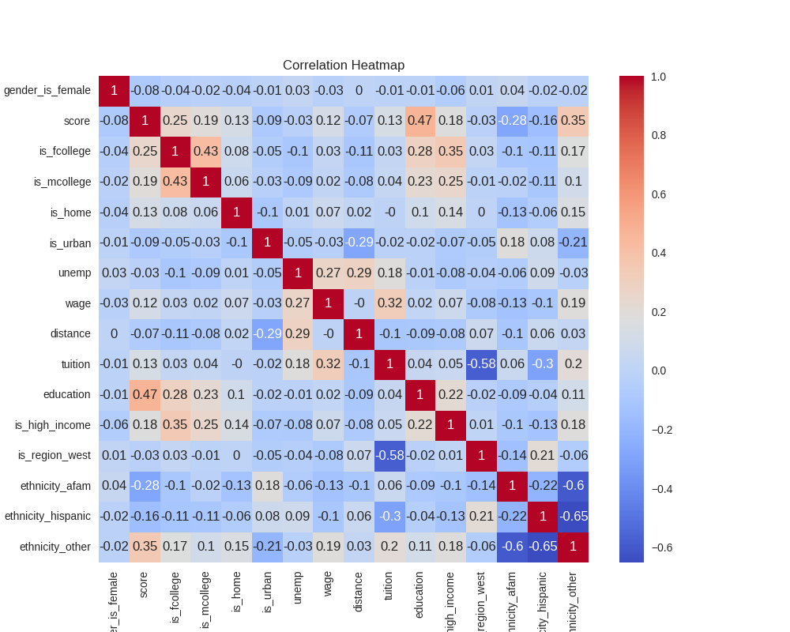
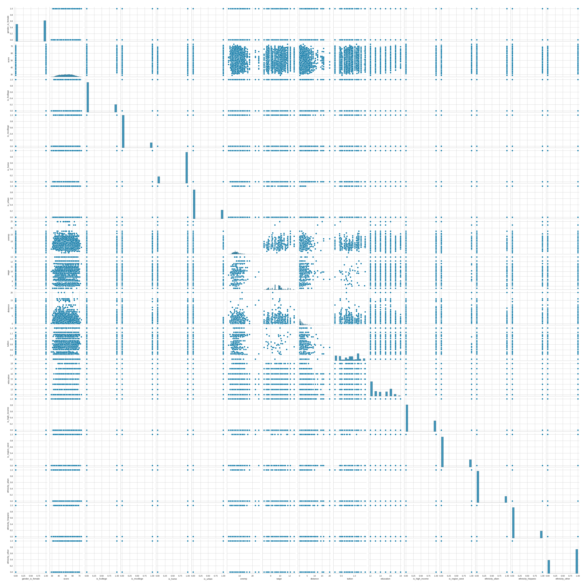

# Feature Engineering

## Data encoding

### Categorical values features

Categorical features was coded as:

!!! example "Changes"

    === "gender"

        ``` markdown
        Renamed to `gender_is_female`
        `female`: True
        `male`: False
        ```

    === "ethnicity"
        
        ``` markdown
        OneHotEncoded
        3 features were created:
        `ethnicity_afam` `ethnicity_hispanic` and `ethnicity_other`
        ```


    === "fcollege/mcollege"

        ``` markdown
        Renamed to `is_fcollege`/`is_mcollege`
        `yes`: True
        `no`: False
        ```
    
    === "home"
        
        ``` markdown
        Renamed to `is_home`
        `yes`: True
        `no`: False
        ```

    === "urban"
        
        ``` markdown
        Renamed to `is_urban`
        `yes`: True
        `no`: False
        ```

    === "income"
        
        ``` markdown
        Renamed to `is_high_income`
        `high`: True
        `low`: False
        ```

    === "region"
        
        ``` markdown
        Renamed to `is_region_west`
        `west`: True
        `other`: False
        ```

## Correlation Heatmap

After transforming categorical features into numerical it is possible to generate proper heatmap correlation between features.

!!! example Correlation Heatmap generating

    === Python

        ```py
        plt.figure(figsize=(10, 8))
        corr = data_df.corr()
        corr_rounded = corr.round(2)
        sns.heatmap(corr, annot=corr_rounded, cmap="coolwarm")
        plt.title("Correlation Heatmap")
        plt.show()
        ```

Output:



On this heatmap, we see that the most correlation for the `score` target feature comes from `education`, `ethnicity_other`, and `is_fcollege`.
This means that:
* A higher amount of total education years implies the highest score, which makes sense.
* If the ethnicity is `other` (not African-American or Hispanic), the score is higher.
* If the `is_fcollege` is set to `True` (father finished college), the score will be higher.
* Similarly, there is a correlation between `is_mcollege` (mother finished college), but it is lower than the previous one.

## Pairplot

!!! example Pairplot generating

    === Python

        ```py
        sns.pairplot(data_df)
        plt.show()
        ```

Output:

