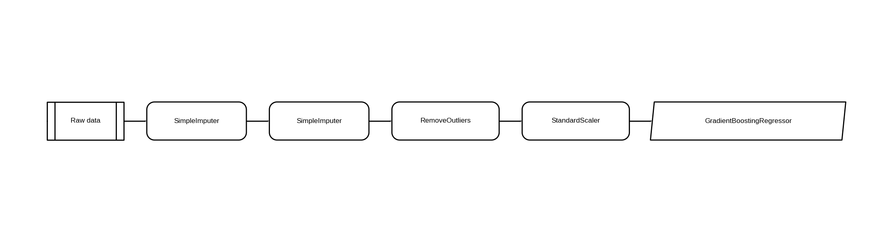
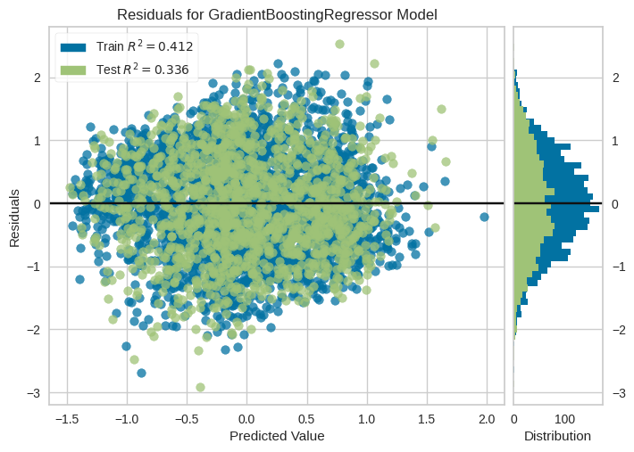

# Creating a model

## Approach

As main approach to create a model `pycaret` library was chosen.
The reason is pycaret provides structured and easy API to create, evaluate and tune model.

## Setting up a `pycaret`

!!! example "pycaret setup"

    === "Python"
    
    ```py
      reg = setup(data_df,
                  target="score",
                  test_data=test_df,
                  remove_outliers=True,
                  fold_strategy="kfold",
                  fold=15,
                  session_id=2137,
                  fold_shuffle=True,
                  use_gpu=True,
                  normalize=True,
                  index=False)
      
      best_model = compare_models()
    ```

Description:

* `data_df`: data.
* `target`: target feature to predict.
* `test_df`: because we split data on our own, we can pass our test data to pycaret.
* `remove_outliers`: removes statistical outliers from the data.
* `fold_strategy`: The method of folds.
* `fold_shuffle`: Does folds needs to be shuffled.
* `fold`: cross-validation for selected model.
* `session_id`: allows to replicate experiment.
* `normalize`: does normalization should be applied:
* `use_gpu`: allows pycaret to use gpu to speed things up.
* `index`: Indicates whether data has an index column.

Output:

_lots of logs_

| Model                           | MAE    | MSE    | RMSE   | R2     | RMSLE  | MAPE   | TT (Sec) |
|---------------------------------|--------|--------|--------|--------|--------|--------|----------|
| gbr Gradient Boosting Regressor | 0.6551 | 0.6549 | 0.8085 | 0.3407 | 0.3708 | 1.9342 | 0.2800   |
| br Bayesian Ridge               | 0.6616 | 0.6578 | 0.8103 | 0.3378 | 0.3807 | 1.9395 | 0.1133   |

!!! note

Given output show only two the best models. Full output table is much larger.

The table shows us, that the best model for this dataset with described analysis and preprocessing is
**Gradient Boosting Regressor**.
Best results in all metrics.

!!! warning "Warning"
Sometimes the best model is not GBR. It can be BR. Hard to understand why it's happening, but GBR is still very good
model to use.

## Model evaluation

| Fold | MAE    | MSE    | RMSE   | R2     | RMSLE  | MAPE   |
|------|--------|--------|--------|--------|--------|--------|
| 0    | 0.6477 | 0.6644 | 0.8151 | 0.3104 | 0.3651 | 1.3917 |
| 1    | 0.6265 | 0.6169 | 0.7854 | 0.4017 | 0.3688 | 1.5117 |
| 2    | 0.6315 | 0.6061 | 0.7785 | 0.4055 | 0.3722 | 1.5609 |
| 3    | 0.6703 | 0.6709 | 0.8191 | 0.3111 | 0.3684 | 2.0291 |
| 4    | 0.6599 | 0.6467 | 0.8041 | 0.3387 | 0.3938 | 1.7867 |
| 5    | 0.6202 | 0.6732 | 0.8205 | 0.3154 | 0.3562 | 1.5384 |
| 6    | 0.6903 | 0.6919 | 0.8318 | 0.2701 | 0.3808 | 1.7269 |
| 7    | 0.6466 | 0.6363 | 0.7977 | 0.3843 | 0.3434 | 1.6471 |
| 8    | 0.6668 | 0.6636 | 0.8146 | 0.3884 | 0.3865 | 1.9079 |
| 9    | 0.6010 | 0.5180 | 0.7197 | 0.4116 | 0.3529 | 3.1464 |
| 10   | 0.6446 | 0.6047 | 0.7776 | 0.3992 | 0.3720 | 3.4132 |
| 11   | 0.6676 | 0.6908 | 0.8311 | 0.3463 | 0.3898 | 1.8291 |
| 12   | 0.6585 | 0.6681 | 0.8174 | 0.2165 | 0.3535 | 1.3079 |
| 13   | 0.7243 | 0.7756 | 0.8807 | 0.3356 | 0.4085 | 2.2211 |
| 14   | 0.6706 | 0.6969 | 0.8348 | 0.2763 | 0.3498 | 1.9954 |
| Mean | 0.6551 | 0.6549 | 0.8085 | 0.3407 | 0.3708 | 1.9342 |
| Std  | 0.0290 | 0.0550 | 0.0344 | 0.0563 | 0.0178 | 0.5815 |

Model diagram



## However...

Our model is overfitted to the train dataset, which is huge problem, because usability of the model is **zero**.

Therefore, tuning is needed.

!!! example "Tuning the model"

    === "Python"
        ```py
        tuned_model = tune_model(model, n_iter=50, early_stopping=True, optimize="R2", choose_better=True)
        ```

And after tuning we can visualise our data performance.

Residuals


Validation Curve


Features importance
.png)

## Afterwords

Model is saved and called `gbr_final_model.pkl` in the repo.

All details and logs of the experiments can be found in the actions artifacts. Look for `logs.txt` (pycaret logs) and
`logging.txt` (whole experiment logs).

As we can see in the Feature Importance plot, the `education` has the bigger impact on the end score for the students.

Moral? Study hard and tests will be passed! 🙂
